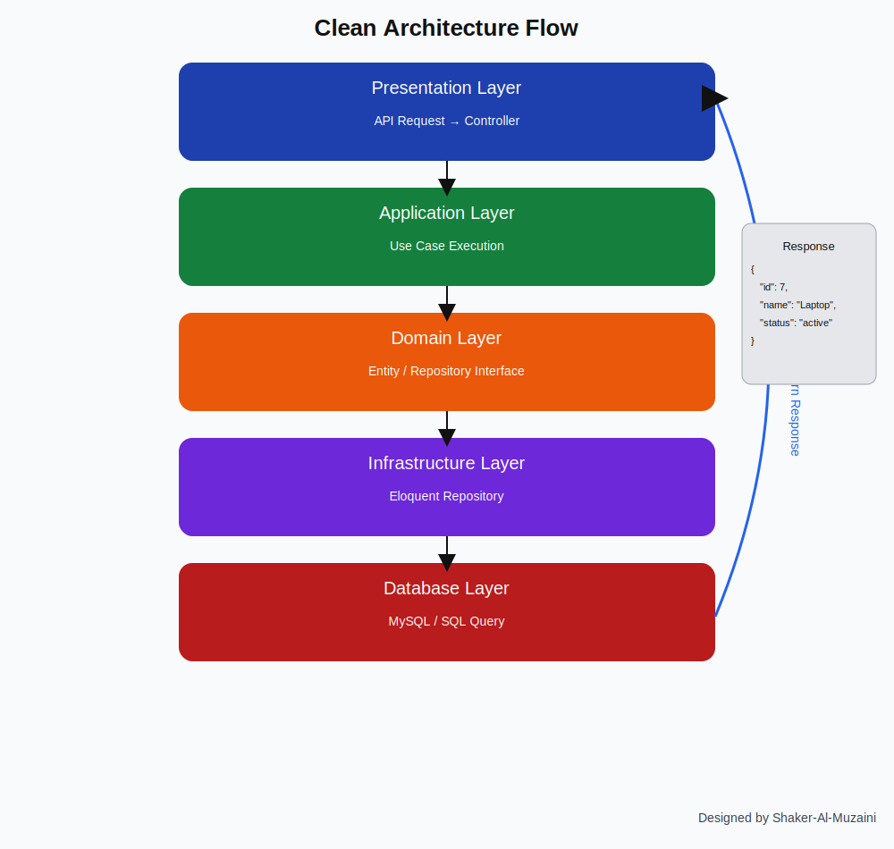

# USE Clean Architecture Diagram

This repository contains a visual explanation of the system architecture
based on Clean Architecture and Domain-Driven Design principles.

---

## 📐 System Architecture

The following diagram shows how requests flow through the system layers:

---

## 🏗 Architecture Layers

### 1️⃣ Presentation Layer
- Handles API requests
- Controllers
- Request validation

### 2️⃣ Application Layer
- Contains Use Cases
- Manages business workflows

### 3️⃣ Domain Layer
- Core business logic
- Entities and Interfaces
- Independent from frameworks

### 4️⃣ Infrastructure Layer
- Database implementation
- Eloquent Repositories
- External services

### 5️⃣ Database Layer
- Data storage
- SQL / MySQL

---

## 🔁 Request Flow

